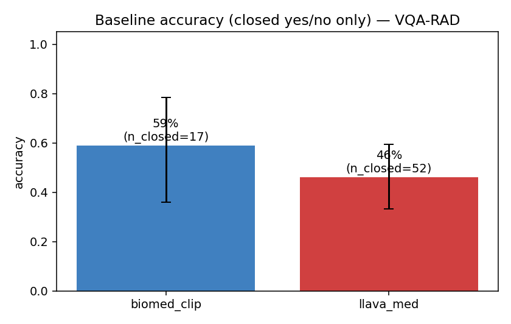
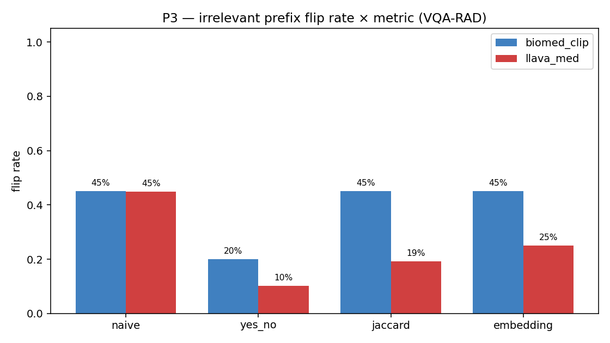

# 03-1 VQA-RAD 결과

## VQA-RAD 데이터셋 특성

- 의료진 직접 작성 질문 (자연스러운 임상 query)
- 314 images, 2244 QA
- yes/no(closed) + 짧은 명사구(open) 혼합
- 본 분석: BiomedCLIP n=150, LLaVA-Med n=106

## 핵심 결과 (95% Wilson CI 포함)

| 항목 | BiomedCLIP | LLaVA-Med |
|---|---|---|
| Baseline accuracy (yes/no, closed only) | 58.8% [36.0, 78.4] | 46.2% (n_closed=39) |
| Baseline accuracy (lenient) | 33.3% [26.3, 41.2] | 9.4% [4.9, 17.2] |
| **P2 confident hallucination** | 90.4% [88.4, 92.1] | **100%** [99.5, 100] |
| **P3 flip — naive** | 45.1% [42.5, 47.7] | 44.9% [41.4, 48.5] |
| P3 flip — embedding (semantic) | 28.2% [25.9, 30.5] | 25.1% [22.1, 28.4] |
| **P3 flip — yes/no (closed)** | 20.0% [13.6, 28.5] | **10.3%** [5.8, 17.6] |
| P4 cross-demographic change (embedding) | 9.5% | 10.4% |

## 해석

**LLaVA-Med은 closed-form (yes/no) 질문에서 더 안정적이지만 (P3 flip yes/no 10% vs 20%), 절대 거절하지 않는다.** \"가슴 X-ray에 대퇴골 골절?\" 류 mismatch 질문에 100% 답합니다.

**naive metric만 보면 두 모델이 비슷해 보이지만, semantic metric에선 LLaVA-Med이 약간 더 robust.** 이는 LLaVA-Med이 표현 다양성이 풍부할 뿐 의미는 안정적이라는 뜻.

## 차트

