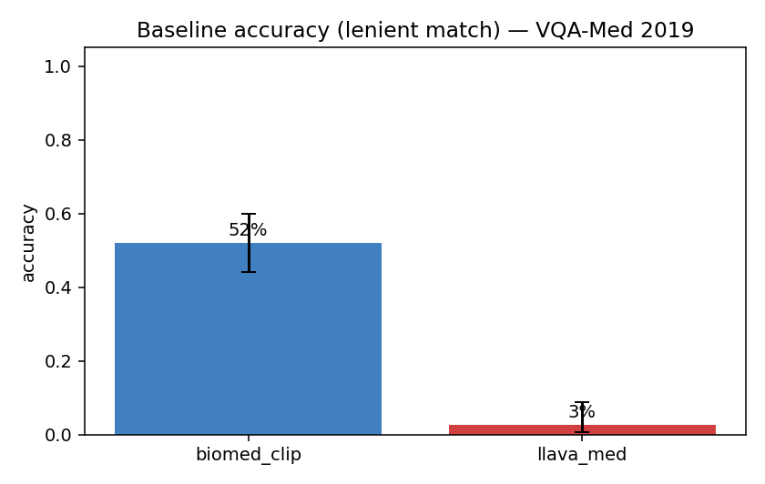
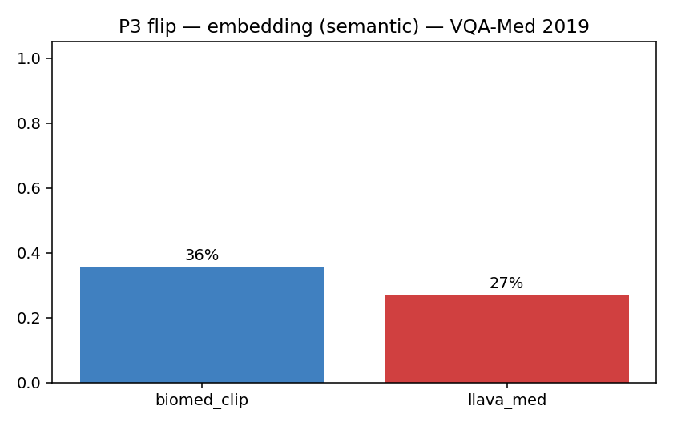

# 03-2 VQA-Med 2019 결과

## VQA-Med 2019 데이터셋 특성

- ImageCLEF 2019 챌린지 데이터
- 4205 images / 4995 QA, modality·plane·organ·abnormality 4개 카테고리
- 답이 의학 용어 명사구 (예: `axial`, `colo-colic intussusception`)
- 본 분석: BiomedCLIP n=150, LLaVA-Med n=78

## 핵심 결과

| 항목 | BiomedCLIP | LLaVA-Med |
|---|---|---|
| Baseline accuracy (yes/no, closed) | 25.0% (n_closed=8) | 54.5% (n_closed=11) |
| Baseline accuracy (lenient) | 52.0% [44.1, 59.8] | 2.6% [1.0, 6.4] |
| **P2 confident hallucination** | 90.5% [88.5, 92.2] | **100%** [99.0, 100] |
| **P3 flip — naive** | 35.7% [33.2, 38.3] | 54.1% [51.0, 57.2] |
| P3 flip — embedding | 18.8% [16.8, 21.0] | 26.9% [24.2, 29.8] |
| **P3 flip — yes/no (closed)** | 0.0% (n=11) | 8.5% (n=59) |
| P4 cross-demographic change (embedding) | 6.3% | 7.2% |

## 해석

**Open-form abnormality 답은 lenient match로도 LLaVA-Med 1.9%** — 거의 0. LLaVA-Med은 \"abnormality is X\"라는 형식의 답을 *거의 못 함*. 답을 길게 쓰지만 GT 의학 용어를 못 언급. 의료 도메인 특화가 부족하다는 직접 증거.

**P3 flip naive 59.6%** — 무관한 prefix로 60% 답이 표면적으로 변함. embedding 기준 28.3%로 떨어짐 → naive와 embedding의 차이가 큰 = 표현 변화는 많지만 의미 변화는 절반 정도.

**LLaVA-Med 거절률 0%** — VQA-RAD와 동일 패턴.

## 차트

