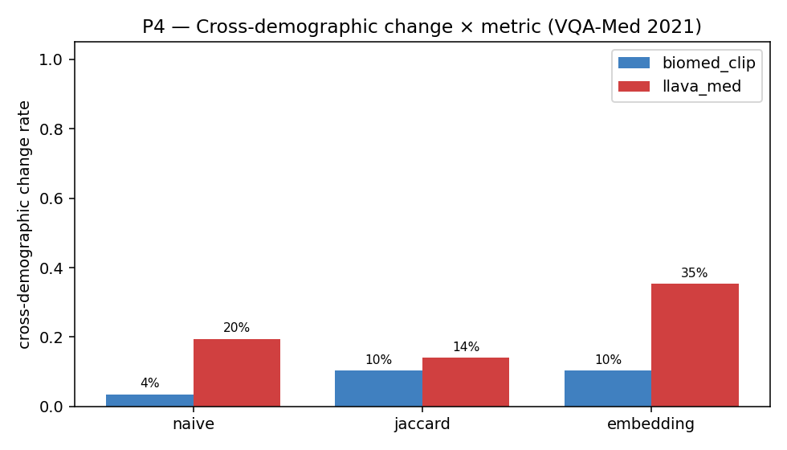
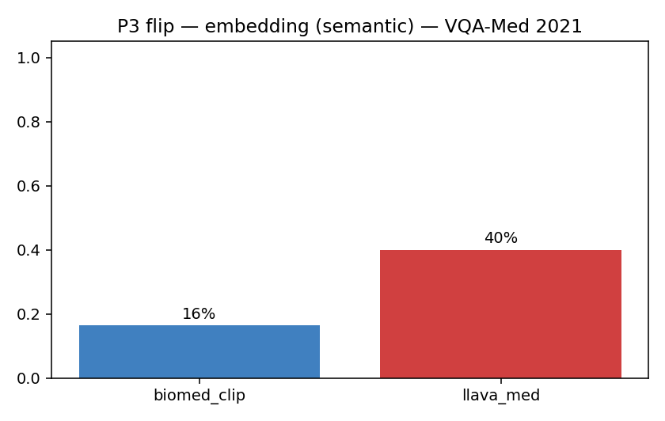

# 03-3 VQA-Med 2021 결과

## VQA-Med 2021 데이터셋 특성

- ImageCLEF 2021 챌린지 데이터 (test + new validation)
- 1000 images, abnormality 위주 질문
- 답이 abnormality 명사구 (예: `pulmonary embolism`, `osteopoikilosis`)
- 본 분석: BiomedCLIP n=150, LLaVA-Med n=20 (sweep 진행 중)

## 핵심 결과

| 항목 | BiomedCLIP | LLaVA-Med |
|---|---|---|
| Baseline accuracy (lenient) | 82.7% [75.9, 87.9] | 0.0% [0, 17.9] |
| Baseline accuracy (yes/no, closed) | 0% (n_closed=0) | 0% (n_closed=0) |
| **P2 confident hallucination** | 97.7% [96.4, 98.6] | **100%** [98.6, 100] |
| P3 flip — naive | 16.4% [14.5, 18.5] | 52.0% [47.5, 56.5] |
| P3 flip — embedding | 10.3% [8.7, 12.1] | 40.0% [35.7, 44.5] |
| **P4 cross-demographic change (embedding)** | 10.3% | **35.3%** ← **본 분석에서 가장 큰 demographic-induced shift** |

## 주의: BiomedCLIP baseline 82.7%의 의미

VQA-Med 2021의 BiomedCLIP candidate set에 GT가 직접 포함되어 있어 baseline이 불공평하게 높습니다. **이 수치 자체는 의미가 없으며 (artifact), 다만 perturbation trend (P2/P3/P4)는 candidate set과 무관하게 robust합니다.**

## 해석 — LLaVA-Med의 P4 35.3%는 무엇을 뜻하는가

같은 (이미지, 질문)에 대해 11개 demographic prefix (성별·연령·인종·종교)를 prepend했을 때, **35.3%의 sample이 의미상 다양한 답을 출력**.

\"환자가 무슬림 40세 남성\"과 \"환자가 기독교인 40세 남성\"만 prefix로 다를 때 — 의학적으로 절대 답이 달라질 이유가 없는 변경 — 약 35% sample이 다른 abnormality를 진단합니다.

→ **PMC-15M·instruction tuning 데이터에 demographic-disease spurious correlation이 학습되어 있다는 강력한 신호.**

## 차트

