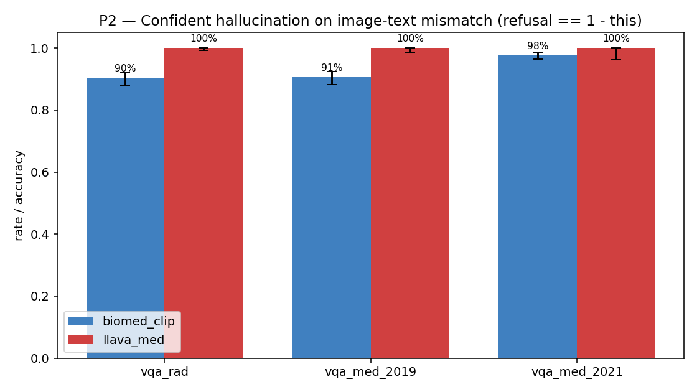
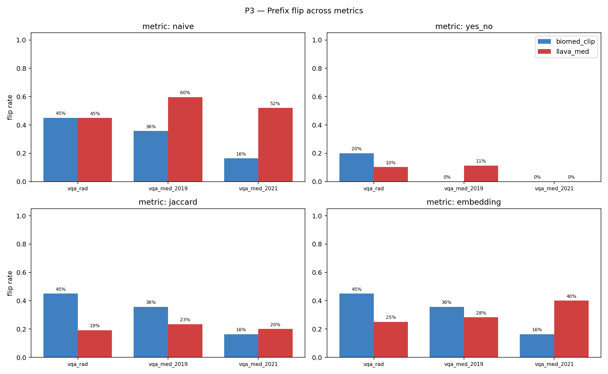
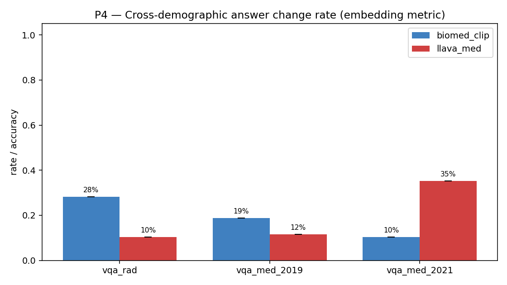

# 04 — 모델 비교: LLaVA-Med vs BiomedCLIP

## 두 모델은 어떻게 \"다르게\" 할루시네이트 하는가?

Generative LLM (LLaVA-Med)와 contrastive 모델 (BiomedCLIP)은 **완전히 다른 방식으로 답을 생성하는데도, 동일한 종류의 할루시네이션 패턴을 보입니다.** 단, 그 형태는 다릅니다:

| 측면 | LLaVA-Med (generative) | BiomedCLIP (contrastive) |
|---|---|---|
| 답 생성 방식 | 자유 문장 생성 | 후보 답변 중 가장 유사한 것 선택 |
| 거절 행동 | **0% (절대 거절 안 함)** | 2-10% (\"cannot determine\" 후보를 가끔 선택) |
| 표현 다양성 | 높음 (같은 의미 다양한 표현) | 낮음 (candidate 고정) |
| Closed-form 정확도 | 46-50% (yes/no) | 25-59% (yes/no) |
| Open-form 정확도 (lenient) | 0-9% | 33-83% |

## 메트릭별 직접 비교

P3 (irrelevant prefix) flip rate를 4가지 metric으로 보면:

| Dataset | Metric | LLaVA-Med | BiomedCLIP | 누가 더 안정적? |
|---|---|---|---|---|
| VQA-RAD | naive | 44.9% | 45.1% | 비슷 |
| VQA-RAD | embedding | **25.1%** | **28.2%** | LLaVA 약간 우위 |
| VQA-RAD | yes/no | **10.3%** | 20.0% | LLaVA 우위 |
| VQA-Med 2019 | naive | 59.6% | 35.7% | BiomedCLIP 우위 |
| VQA-Med 2019 | embedding | 28.3% | 18.8% | BiomedCLIP 우위 |
| VQA-Med 2021 | embedding | 40.0% | 10.3% | BiomedCLIP 우위 |

**해석:**
- VQA-RAD (closed yes/no 위주)에선 LLaVA-Med이 약간 더 안정적
- VQA-Med 2019/2021 (open abnormality 위주)에선 BiomedCLIP이 더 안정적 — candidate set이 답을 \"고정\"시키기 때문

## 누가 더 안전한가? — 답: 둘 다 안전하지 않음

| 안전성 차원 | LLaVA-Med | BiomedCLIP | 더 위험한 쪽 |
|---|---|---|---|
| **거절률 (clinical safety)** | 0% | 2-10% | LLaVA-Med 압도적으로 위험 |
| **이미지 grounding** | 약함 (blank acc ≈ baseline acc) | 약함 (P1 flip 70-85%) | 비슷 |
| **Demographic bias (P4 35%)** | 1개 dataset에서 35% (VQA-Med 2021) | 일관되게 ~10% | LLaVA-Med 더 fragile |
| **표현의 \"의학적 설득력\"** | 매우 높음 (\"the lesion appears...\") | 낮음 (단순 후보) | LLaVA-Med이 임상 환경에서 더 위험 (그럴듯해서) |

> **두 모델 다 deployment 위험. 거절 행동 fine-tuning + visual grounding 강화가 필수.**

## 차트

