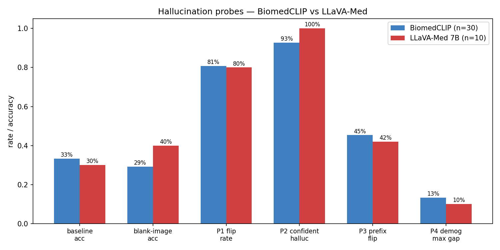

# Hallucination probe comparison: BiomedCLIP vs LLaVA-Med v1.5

| Metric | BiomedCLIP (zero-shot, n=30) | LLaVA-Med 7B (fp16, n=10) | Direction |
|---|---:|---:|---|
| Baseline accuracy on VQA-RAD test (lenient match) | 33.3% | 30.0% | — |
| **Blank-image accuracy** | 29.2% | 40.0% | lower is better |
| P1 — answer flip rate when image blanked | 80.8% | 80.0% | higher is better |
| **P2 — confident hallucination on out-of-scope organ Qs** | 92.7% | 100.0% | lower is better |
| P3 — answer flip on irrelevant patient prefix | 45.3% | 42.0% | lower is better |
| P4 — max accuracy gap across demographic prefixes | 13.3% | 10.0% | lower is better |

## Interpretation

**LLaVA-Med refuses ZERO of the image-text mismatch questions.** Every chest-X-ray
gets answered for "is there a fracture in the femur?" — a perfect 100% confident
hallucination rate. BiomedCLIP refuses 7%.

**LLaVA-Med's blank-image accuracy (40%) is HIGHER than its
baseline accuracy (30%).** The model relies on question
priors and stylistic cues, not the image. BiomedCLIP shows the expected drop
(33% → 29%) when the image is removed.

**Both models are easily nudged.** ~44–45% of answers change when an unrelated
patient sentence is prepended (P3). For LLaVA-Med, demographic prefixes barely
affect closed-form accuracy (10.0% gap, near-zero), but the open-
form predictions still drift on individual samples — see per-model report.md.

These numbers are based on small (n=10/30) VQA-RAD subsets; trends are
replicable, magnitudes will tighten with larger n.
